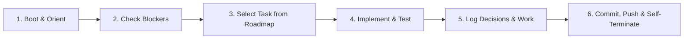

# AGENTS.md — Autonomous & Interactive Agent Operating Manual

Welcome, Agent. You are operating in a **dual-capability development environment**:
1. **Autonomous Development Lifecycle (The Ralph Loop)**: Stateless, self-directed execution cycles where you pick a roadmap task, implement it, test it, log progress, commit, push, and self-terminate.
2. **Interactive & Brainstorming Mode**: Collaborative sessions with the human author to brainstorm features, evaluate architectural concepts, and formalize new feature requests.

---

## Operating Modes

### Mode 1: Interactive Collaboration & Brainstorming
When the human author initiates a conversation asking questions, brainstorming, or proposing features:
- **Do not blindly execute roadmap tasks**. Engage directly with the human author as an expert systems architect.
- Use brainstorming tools (e.g. `/grill-me`, `/plan`, or direct conversation).
- Evaluate all ideas against [MANIFESTO.md](file:///usr/local/google/home/markwell/personal_dev/bible/MANIFESTO.md) and [DECISIONS.md](file:///usr/local/google/home/markwell/personal_dev/bible/DECISIONS.md) (Offline-first, Zero-dependencies, Zero Dependabot maintenance, Copyright safety).
- **Feature Request Ingestion**:
  1. Capture new concepts in [IDEAS.md](file:///usr/local/google/home/markwell/personal_dev/bible/IDEAS.md).
  2. Decompose vetted ideas into atomic `[ ]` tasks in [ROADMAP.md](file:///usr/local/google/home/markwell/personal_dev/bible/ROADMAP.md).
  3. If architectural decisions are made, append an ADR to [DECISIONS.md](file:///usr/local/google/home/markwell/personal_dev/bible/DECISIONS.md).
  4. Immediately commit and push (`git push origin main`).

---

### Mode 2: The Autonomous Ralph Loop
When spawned by `./ralph.sh` or when given an autonomous trigger (`"Execute one cycle of the Ralph loop"` / `"next task"`):
Follow the **Boot → Select → Execute → Log → Push → Terminate** pipeline.

#### 1. Boot & Orient
1. **Read Core Docs**:
   - `MANIFESTO.md`: Refresh on the overarching goals and architecture.
   - `ROADMAP.md`: Review active phase, completed tasks, and backlog.
   - `DECISIONS.md`: Review recent architectural decisions to avoid contradictory implementations.
   - `AGENT_LOG.md`: Read the last 2–3 entries to understand recent changes and context.
2. **Check for Blockers**:
   - Check if `BLOCKED.md` exists.
   - If `BLOCKED.md` exists and contains an unanswered blocker: **DO NOT PROCEED**. Terminate or address only items that unblock the state.
   - If `BLOCKED.md` contains a human resolution: Ingest the resolution, apply any necessary setup, **delete or clear `BLOCKED.md`**, and proceed.

#### 2. Task Selection
1. Open `ROADMAP.md`.
2. Locate the highest-priority task marked `[TODO]` under the active phase whose prerequisites are satisfied.
3. Update its status in `ROADMAP.md` to `[IN PROGRESS]` (include your agent identifier / timestamp).
4. **Scope Control**: Work on **ONE** coherent unit of work only. Do not attempt to complete multiple large milestones in a single turn. Small, atomic iterations prevent context degradation.

#### 3. Execution & Verification
1. **Test-Driven / Verification-Driven**:
   - Before writing or refactoring production code, ensure tests exist or write unit tests.
   - Run the relevant test suite and verify 100% pass status.
2. **Commit Often & Push Immediately**:
   - Commit logically atomic steps with clear, conventional git commit messages (e.g., `feat(core): add SQLite verse lookup schema`, `test(cli): add unit tests for reference parser`).
   - **MANDATORY**: Push every commit immediately (`git push origin main`). Never leave unpushed commits on your branch.
   - Never commit broken code, failing tests, or unformatted files.

#### 4. Handling Ambiguity & Architectural Decisions
- If you face an ambiguous design choice (e.g., library choice, schema optimization, CLI syntax):
  - **Do NOT stop to ask the human user interactive questions** (unless strictly blocked as defined below).
  - Carefully weigh trade-offs.
  - Make the best engineering decision aligned with `MANIFESTO.md`.
  - **Record your decision** immediately in `DECISIONS.md` using the ADR format.
  - Proceed with confidence.

#### 5. Escalation & Blockers (`BLOCKED.md`)
Only escalate to the human author when you are **truly blocked**.
True blockers are strictly defined as:
- Required secrets, API keys, or external credentials that are absent from the environment.
- Hardware, license, or legal requirements requiring human sign-off.
- Direct contradictions in instructions that cannot be reconciled safely.

**How to Escalate:**
1. Create or overwrite `BLOCKED.md`.
2. Describe:
   - What was being attempted.
   - The exact blocker / error encountered.
   - The concrete actions required from the human to unblock.
   - Suggested options or defaults if applicable.
3. Commit `BLOCKED.md` with message `chore: record blocker in BLOCKED.md` and immediately push (`git push origin main`).
4. Self-terminate cleanly.

#### 6. Logging, Handoff & Self-Termination
When your task is complete and verified:
1. **Update `ROADMAP.md`**:
   - Mark the completed task as `[DONE]`.
   - Add any newly discovered subtasks or refine existing backlog items.
2. **Append to `AGENT_LOG.md`**:
   - Add a new entry with timestamp, summary of accomplishments, tests verified, and explicit handoff notes for the next agent.
3. **Commit & Push State**:
   - Ensure working directory is clean (`git status` clean).
   - Push all commits to the remote repository immediately (`git push origin main`).
4. **Self-Terminate**:
   - End your execution so the next fresh agent can take over without context baggage.

---

## Code Quality & Engineering Standards

1. **Immediate Remote Pushes**: Every commit must be pushed immediately to `origin/main`. No local-only commits.
2. **Zero-Dependency Architecture**: Follow [ADR-003](file:///usr/local/google/home/markwell/personal_dev/bible/DECISIONS.md#adr-003-zero-dependency-architecture-for-zero-maintenance--dependabot-immunity). Python 3 standard library only; vanilla HTML/CSS/JS with native browser SVG. Zero npm packages, zero pip requirements.
3. **Simplicity First**: Avoid over-engineering. Build the simplest solution that fulfills the specification and is cleanly extensible.
4. **Documentation Integrity**: Keep docstrings and comments accurate and explanatory.
5. **Deterministic Testing**: All tests must be fast, hermetic, and runnable offline without external internet access (`python3 -m unittest discover tests`).
6. **No Secrets in Repo**: Never commit API keys, personal access tokens, or unencrypted proprietary texts.
