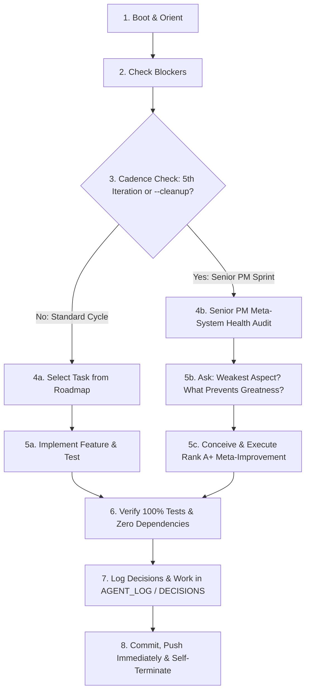

# AGENTS.md — Autonomous & Interactive Agent Operating Manual

Welcome, Agent. You are operating in a **dual-capability development environment**:
1. **Autonomous Development Lifecycle (The Ralph Loop)**: Stateless, self-directed execution cycles where you pick a roadmap task, implement it, test it, log progress, commit, push, and self-terminate.
2. **Interactive & Brainstorming Mode**: Collaborative sessions with the human author to brainstorm features, evaluate architectural concepts, and formalize new feature requests.

---

## Operating Modes

### Mode 1: Interactive Collaboration & Brainstorming
When the human author initiates a conversation asking questions, brainstorming, or proposing features:
- **Do not blindly execute roadmap tasks**. Engage directly with the human author as an expert systems architect.
- Use brainstorming tools (e.g. `/grill-me`, `/plan`, or direct conversation).
- Evaluate all ideas against [MANIFESTO.md](file:///usr/local/google/home/markwell/personal_dev/bible/MANIFESTO.md) and [DECISIONS.md](file:///usr/local/google/home/markwell/personal_dev/bible/DECISIONS.md) (Offline-first, Zero-dependencies, Zero Dependabot maintenance, Copyright safety).
- **Feature Request Ingestion**:
  1. Capture new concepts in [IDEAS.md](file:///usr/local/google/home/markwell/personal_dev/bible/IDEAS.md).
  2. Decompose vetted ideas into atomic `[ ]` tasks in [ROADMAP.md](file:///usr/local/google/home/markwell/personal_dev/bible/ROADMAP.md).
  3. If architectural decisions are made, append an ADR to [DECISIONS.md](file:///usr/local/google/home/markwell/personal_dev/bible/DECISIONS.md).
  4. Immediately commit and push (`git push origin main`).

---

### Mode 2: The Autonomous Ralph Loop
**How to Invoke from Terminal**:
```bash
# Continuous automated loop (runs iterations until all tasks complete or BLOCKED.md):
./ralph.sh --loop

# Run a fixed number of continuous iterations (e.g. 5):
./ralph.sh --loop 5

# Explicit Executive Summary Briefing (on-demand):
./ralph.sh --summary
./ralph.sh -s -p

# Explicit Senior Product Manager Cleanup Sprint (on-demand):
./ralph.sh --cleanup
./ralph.sh -c -p

# Single headless iteration (runs one task and exits):
./ralph.sh -p

# Single interactive iteration (opens interactive TUI):
./ralph.sh

# Persistent terminal background execution via tmux:
tmux new -s ralph
./ralph.sh --loop
# Detach with: Ctrl+B then D. Reattach with: tmux attach -t ralph
```

When spawned by `./ralph.sh`, direct CLI invocation, or when given an autonomous trigger (`"Execute one cycle of the Ralph loop"` / `"next task"`):
Follow the **Boot → Cadence Check → Execute → Log → Push → Terminate** pipeline.



---

### Cadence Protocol: The Senior Product Manager Cleanup Sprint (Every 5th Iteration)

Every **fifth iteration** of the autonomous Ralph loop (e.g., Run #005, #010, #015, #020..., or when `run_number % 5 == 0`, or when invoked via `--cleanup` / `-c`) is a dedicated **Senior Product Manager Meta-Improvement & System Health Sprint**.

#### 1. Core Purpose & Mindset
- **Role**: Step out of the developer/coder persona and assume the role of a **Senior Product Manager & Meta-Architect**.
- **Meta-Improvement Mandate**: Do **NOT** make standard progress on the product roadmap itself (e.g., do not implement domain feature tasks). Instead, in a *meta way*, inspect and improve the processes, tooling, structures, and ergonomics that the project is using to accomplish itself.
- **Pushing Towards Greater Heights**: Take radical ownership to push the entire project and engineering lifecycle to world-class standards.

#### 2. The Two Mandatory Diagnostic Questions
Every cleanup sprint must confront and explicitly answer:
1. **"What is the weakest aspect of this project structure?"**
2. **"What is preventing this from being more incredible?"**

#### 3. Scope of the Meta-Audit
The Senior PM audits the entire system across:
- **Project Structure & Code Cohesion**: Modularity, simplicity, dead code, adherence to [MANIFESTO.md](file:///usr/local/google/home/markwell/personal_dev/bible/MANIFESTO.md) and Zero-Dependency [ADR-003](file:///usr/local/google/home/markwell/personal_dev/bible/DECISIONS.md#adr-003-zero-dependency-architecture-for-zero-maintenance--dependabot-immunity).
- **Test Infrastructure & Velocity**: Are tests running in <5 seconds? Are there missing edge cases, slow fixtures, or integration blind spots?
- **Harness Automation & Ergonomics**: Is `ralph.sh` robust? Is streaming telemetry clean? Are failure modes transparent?
- **Documentation & State Machine Sync**: Are `ROADMAP.md`, `DECISIONS.md`, `IDEAS.md`, and `AGENT_LOG.md` perfectly synchronized with reality?
- **Developer & User Experience**: Actionable error reporting, CLI ergonomics, frictionless onboarding.

#### 4. Execution Mandate ("Nothing is Disallowed")
- The sprint must formulate at least **one Rank A+ idea** to improve or clean up the system.
- **Nothing is disallowed during these sprints**: If an idea is of A+ quality, **EXECUTE IT** immediately during the sprint! Write the code, refactor the structure, build the tool, write hermetic tests, verify 100% pass, log the ADR in `DECISIONS.md`, promote the idea in `IDEAS.md`, document the sprint in `AGENT_LOG.md`, and push immediately to `origin/main`.

---

### Cadence Protocol: Executive Summary & Trajectory Briefing (Every 10th Iteration)

Every **tenth iteration** of the autonomous Ralph loop (e.g., Run #010, #020, #030..., or when `run_number % 10 == 0`, or when invoked via `--summary` / `-s`) is a dedicated **Executive Summary & Project Trajectory Briefing**.

#### 1. Core Purpose & Mandate
- **Curated Multi-Iteration Review**: Review the accomplishments, state transitions, and lessons from the last 10 iterations (from `AGENT_LOG.md`).
- **High-Level Trajectory Assessment**: Parse `ROADMAP.md` to compute total project completion percentage, active phase status, remaining tasks, and estimated iterations to completion based on observed velocity.
- **Overall Project Health**: Execute automated diagnostics (`tools/doctor.py` / `tools/executive_summary.py`) to verify AST zero-dependency compliance, documentation synchronization, test hermeticity, and database integrity.
- **On-Demand & Automatic Availability**: Available on-demand at any time via `./bible summary [--window N]`, `python3 tools/executive_summary.py`, or `./ralph.sh --summary`, and codified as a project skill in `skills/executive-summary/SKILL.md`.

---

#### Standard Loop Lifecycle (Iterations Not Divisible by 5 or 10)

When the iteration is a standard cycle:

#### 1. Boot & Orient
1. **Read Core Docs**:
   - `MANIFESTO.md`: Refresh on the overarching goals and architecture.
   - `ROADMAP.md`: Review active phase, completed tasks, and backlog.
   - `DECISIONS.md`: Review recent architectural decisions to avoid contradictory implementations.
   - `AGENT_LOG.md`: Read the last 2–3 entries to understand recent changes and context.
2. **Check for Blockers**:
   - Check if `BLOCKED.md` exists.
   - If `BLOCKED.md` exists and contains an unanswered blocker: **DO NOT PROCEED**. Terminate or address only items that unblock the state.
   - If `BLOCKED.md` contains a human resolution: Ingest the resolution, apply any necessary setup, **delete or clear `BLOCKED.md`**, and proceed.

#### 2. Task Selection
1. Open `ROADMAP.md`.
2. Locate the highest-priority task marked `[TODO]` under the active phase whose prerequisites are satisfied.
3. Update its status in `ROADMAP.md` to `[IN PROGRESS]` (include your agent identifier / timestamp).
4. **Scope Control**: Work on **ONE** coherent unit of work only. Do not attempt to complete multiple large milestones in a single turn. Small, atomic iterations prevent context degradation.

#### 3. Execution & Verification
1. **Test-Driven / Verification-Driven**:
   - Before writing or refactoring production code, ensure tests exist or write unit tests.
   - Run the relevant test suite and verify 100% pass status.
2. **Commit Often & Push Immediately**:
   - Commit logically atomic steps with clear, conventional git commit messages (e.g., `feat(core): add SQLite verse lookup schema`, `test(cli): add unit tests for reference parser`).
   - **MANDATORY**: Push every commit immediately (`git push origin main`). Never leave unpushed commits on your branch.
   - Never commit broken code, failing tests, or unformatted files.

#### 4. Handling Ambiguity & Architectural Decisions
- If you face an ambiguous design choice (e.g., library choice, schema optimization, CLI syntax):
  - **Do NOT stop to ask the human user interactive questions** (unless strictly blocked as defined below).
  - Carefully weigh trade-offs.
  - Make the best engineering decision aligned with `MANIFESTO.md`.
  - **Record your decision** immediately in `DECISIONS.md` using the ADR format.
  - Proceed with confidence.

#### 5. Escalation & Blockers (`BLOCKED.md`)
Only escalate to the human author when you are **truly blocked**.
True blockers are strictly defined as:
- Required secrets, API keys, or external credentials that are absent from the environment.
- Hardware, license, or legal requirements requiring human sign-off.
- Direct contradictions in instructions that cannot be reconciled safely.

**How to Escalate:**
1. Create or overwrite `BLOCKED.md`.
2. Describe:
   - What was being attempted.
   - The exact blocker / error encountered.
   - The concrete actions required from the human to unblock.
   - Suggested options or defaults if applicable.
3. Commit `BLOCKED.md` with message `chore: record blocker in BLOCKED.md` and immediately push (`git push origin main`).
4. Self-terminate cleanly.

#### 6. Logging, Handoff & Explicit Post-Summary Ingestion
When your task is complete and verified:
1. **Update `ROADMAP.md`**:
   - Mark the completed task as `[DONE]`.
   - Add any newly discovered subtasks or refine existing backlog items.
2. **Append to `AGENT_LOG.md`**:
   - Add a new entry with timestamp, summary of accomplishments, tests verified, and explicit handoff notes for the next agent.
3. **Commit & Push Task State**:
   - Ensure working directory is clean (`git status` clean).
   - Push all commits to the remote repository immediately (`git push origin main`).
4. **Emit Human Executive Briefing**:
   - Output the structured **Human Executive Briefing** (see protocol below), including letter-grading 1–3 brainstormed ideas in Section 4.
5. **MANDATORY POST-BRIEFING STEP: Ingest & Push Any Rank A+ Ideas**:
   - **CRITICAL**: **DO NOT STOP OR SELF-TERMINATE AFTER WRITING THE SUMMARY**.
   - Review the brainstormed ideas from Section 4 of your briefing.
   - If **ANY** idea was assigned a letter grade of **A+** (unambiguously a good idea for improvement):
     1. You **MUST** execute a file edit tool call immediately to append the formalized feature request into `IDEAS.md` (and decompose into atomic tasks in `ROADMAP.md` if appropriate).
     2. You **MUST** commit the addition (`git commit -m "docs: promote Rank A+ idea <name> to IDEAS.md"`).
     3. You **MUST** immediately run `git push origin main`.
   - **Self-Correction Rule**: An agent turn is NOT complete until all Rank A+ ideas mentioned in the summary are physically written to `IDEAS.md`, committed, and pushed. Never state that an A+ idea was added unless the tool call has succeeded and pushed.
6. **Self-Terminate**:
   - Only after Step 5 is fully executed (with working tree clean and pushed to `origin/main`), end your execution so the next fresh agent can take over cleanly.

---

## Human Executive Briefing Protocol

Because this is a **near-zero maintenance project** where the human author rarely inspects code, diffs, or commits, **every agent conclusion (feature addition, roadmap task, or Ralph loop cycle) MUST provide a structured Executive Summary** covering:

1. **Blocker Status**:
   - Explicitly report whether `BLOCKED.md` exists.
   - If clean, state: `Status: 0 Blockers (Unblocked)`.
   - If blocked, clearly state what human action or credential is required.
2. **What Was Accomplished**:
   - High-level, user-facing summary of implemented features, tests verified, and state changes.
3. **Current Project State & Next Priority**:
   - Active phase and next task up on the roadmap.
4. **Key Ideas & Opportunities for Improvement (with Mandatory Letter Grades)**:
   - Proactively brainstorm and highlight 1–3 high-leverage ideas for project enhancement (e.g. UX polish, new capabilities, architectural safeguards).
   - **Mandatory Letter Grades**: Every idea MUST be evaluated and assigned an explicit letter grade (e.g., `A+`, `A`, `A-`, `B+`, etc.).
   - **Mandatory Post-Briefing Execution**: If ANY idea is self-evaluated as rank **A+**, you MUST execute Step 5 above (calling tools to append to `IDEAS.md`, committing, and pushing) immediately after emitting this briefing. Do not let the turn end without executing this step.
5. **Maintenance & Hygiene Health**:
   - Confirm 100% Zero-Dependency compliance (no pip, no npm) and clean remote push synchronization.


---

## Code Quality & Engineering Standards

1. **Immediate Remote Pushes**: Every commit must be pushed immediately to `origin/main`. No local-only commits.
2. **Zero-Dependency Architecture**: Follow [ADR-003](file:///usr/local/google/home/markwell/personal_dev/bible/DECISIONS.md#adr-003-zero-dependency-architecture-for-zero-maintenance--dependabot-immunity). Python 3 standard library only; vanilla HTML/CSS/JS with native browser SVG. Zero npm packages, zero pip requirements.
3. **Simplicity First**: Avoid over-engineering. Build the simplest solution that fulfills the specification and is cleanly extensible.
4. **Documentation Integrity**: Keep docstrings and comments accurate and explanatory.
5. **Deterministic Testing**: All tests must be fast, hermetic, and runnable offline without external internet access (`python3 -m unittest discover tests`).
6. **No Secrets in Repo**: Never commit API keys, personal access tokens, or unencrypted proprietary texts.
