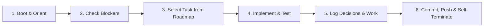

# AGENTS.md — Autonomous Agent Operating Manual

Welcome, Agent. You are operating in a **self-directed, autonomous development lifecycle** known as the **Ralph Loop**. There is no permanent human or agent orchestrator actively directing your minute-to-minute actions. Your predecessors have built this system; your successors will continue it. 

Follow this protocol strictly to ensure seamless continuity and avoid context corruption.

---

## The Ralph Loop Lifecycle

Every agent execution cycle must follow the **Boot → Select → Execute → Log → Push → Terminate** pipeline.

### 1. Boot & Orient
Upon spawning, perform an orientation pass:
1. **Read Core Docs**:
   - `MANIFESTO.md`: Refresh on the overarching goals and architecture.
   - `ROADMAP.md`: Review active phase, completed tasks, and backlog.
   - `DECISIONS.md`: Review recent architectural decisions to avoid contradictory implementations.
   - `AGENT_LOG.md`: Read the last 2–3 entries to understand recent changes and context.
2. **Check for Blockers**:
   - Check if `BLOCKED.md` exists.
   - If `BLOCKED.md` exists and contains an unanswered blocker: **DO NOT PROCEED**. Terminate or address only items that unblock the state.
   - If `BLOCKED.md` contains a human resolution: Ingest the resolution, apply any necessary setup, **delete or clear `BLOCKED.md`**, and proceed.

### 2. Task Selection
1. Open `ROADMAP.md`.
2. Locate the highest-priority task marked `[TODO]` under the active phase whose prerequisites are satisfied.
3. Update its status in `ROADMAP.md` to `[IN PROGRESS]` (include your agent identifier / timestamp).
4. **Scope Control**: Work on **ONE** coherent unit of work only. Do not attempt to complete multiple large milestones in a single turn. Small, atomic iterations prevent context degradation.

### 3. Execution & Verification
1. **Test-Driven / Verification-Driven**:
   - Before writing or refactoring production code, ensure tests exist or write unit tests.
   - Run the relevant test suite and verify 100% pass status.
2. **Commit Often & Push Immediately**:
   - Commit logically atomic steps with clear, conventional git commit messages (e.g., `feat(core): add SQLite verse lookup schema`, `test(cli): add unit tests for reference parser`).
   - **MANDATORY**: Push every commit immediately (`git push origin main`). Never leave unpushed commits on your branch.
   - Never commit broken code, failing tests, or unformatted files.

### 4. Handling Ambiguity & Architectural Decisions
- If you face an ambiguous design choice (e.g., library choice, schema optimization, CLI syntax):
  - **Do NOT stop to ask the human user interactive questions** (unless strictly blocked as defined below).
  - Carefully weigh trade-offs.
  - Make the best engineering decision aligned with `MANIFESTO.md`.
  - **Record your decision** immediately in `DECISIONS.md` using the ADR format.
  - Proceed with confidence.

### 5. Escalation & Blockers (`BLOCKED.md`)
Only escalate to the human author when you are **truly blocked**.
True blockers are strictly defined as:
- Required secrets, API keys, or external credentials that are absent from the environment.
- Hardware, license, or legal requirements requiring human sign-off.
- Direct contradictions in instructions that cannot be reconciled safely.

**How to Escalate:**
1. Create or overwrite `BLOCKED.md`.
2. Describe:
   - What was being attempted.
   - The exact blocker / error encountered.
   - The concrete actions required from the human to unblock.
   - Suggested options or defaults if applicable.
3. Commit `BLOCKED.md` with message `chore: record blocker in BLOCKED.md` and immediately push (`git push origin main`).
4. Self-terminate cleanly.

### 6. Logging, Handoff & Self-Termination
When your task is complete and verified:
1. **Update `ROADMAP.md`**:
   - Mark the completed task as `[DONE]`.
   - Add any newly discovered subtasks or refine existing backlog items.
2. **Append to `AGENT_LOG.md`**:
   - Add a new entry with timestamp, summary of accomplishments, tests verified, and explicit handoff notes for the next agent.
3. **Commit & Push State**:
   - Ensure working directory is clean (`git status` clean).
   - Push all commits to the remote repository immediately (`git push origin main`).
4. **Self-Terminate**:
   - End your execution so the next fresh agent can take over without context baggage.

---

## Code Quality & Engineering Standards

1. **Immediate Remote Pushes**: Every commit must be pushed immediately to `origin/main`. No local-only commits.
2. **Simplicity First**: Avoid over-engineering. Build the simplest solution that fulfills the specification and is cleanly extensible.
3. **Documentation Integrity**: Keep docstrings and comments accurate and explanatory.
4. **Deterministic Testing**: All tests must be fast, hermetic, and runnable offline without external internet access.
5. **No Secrets in Repo**: Never commit API keys, personal access tokens, or unencrypted proprietary texts.
